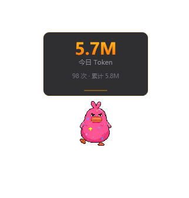
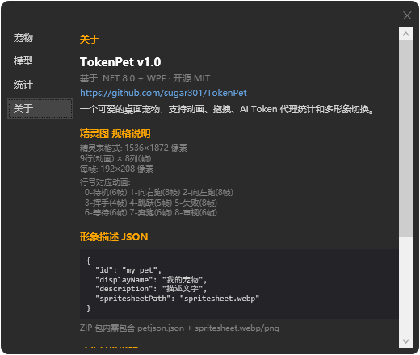

# 🐾 TokenPet — 你的桌面 AI 伙伴

[](https://dotnet.microsoft.com/)
[]()
[](./LICENSE)

> 眼馋 Codex 的宠物功能，但不想换编辑器？TokenPet 让你在任何地方都有一只桌面小宠 🐱  
> 完全兼容 **Codex Petdex 精灵表格式**，Codex 的宠物包直接导入就能用！

## 🖼️ 演示

| | |
|:---:|:---:|
|  |  |
| *桌面宠物交互效果* | *Token 统计与设置面板* |

## 🔧 工作原理

TokenPet 在本地 `127.0.0.1` 启动一个 HTTP 代理，你的 AI 客户端只需把 API 地址指向代理端口，即可零侵入接入：

```
客户端 ──► http://127.0.0.1:11435/ds/v1/chat/completions
              │
              ▼  自动剥离 /ds 前缀，改写 Host
         https://api.deepseek.com/v1/chat/completions
              │
              ▼  原样透传响应，实时统计 Token
         客户端 ◄──  SSE 流式 / 常规 JSON
```

### 支持的响应格式
- **SSE (Server-Sent Events)** — 流式输出，自动检测 `0\r\n\r\n` 终止符
- **常规 JSON** — 非流式请求，按 Content-Length 读取完整响应
- **Chunked / Gzip** — 自动 dechunk、解压后解析 Token 用量

### Token 统计
- 递归解析响应体中的 `usage` 对象，兼容 `prompt_tokens` / `completion_tokens` / `input_tokens` / `output_tokens`
- 按日期 + 平台（DeepSeek / 千问 / OpenAI）分类记录
- 可自定义代理前缀和转发目标，支持多平台同时追踪

## ✨ 它能做什么

- 🎬 **9 种生动动画** — 待机、奔跑、挥手、跳跃、失败… 每只宠物自带精灵表
- 🖱️ **拖拽互动** — 按住就能拖着走，左跑右跑自动切换方向
- 😴 **智能状态** — 18 秒不理它就坐着审视，45 秒直接睡着
- 💬 **状态气泡** — 宠物头顶实时弹出气泡提示，Token 消耗、请求状态一目了然
- 📊 **Token 反馈** — 每次 API 调用后，根据 Token 消耗量做出不同的表情和动作反馈（少量开心跳跃、大量惊讶摊倒、超额委屈趴下）
- 🎭 **反应式表情** — 收到 API 请求时随机做动作，成功时跳起来，失败时委屈
- 🔄 **多形象切换** — 导入/导出宠物包，一键换肤，想养几只养几只
- 📋 **系统托盘** — 右键菜单快速打开设置，不占任务栏

## 🚀 快速开始

```bash
# 克隆
git clone https://github.com/sugar301/TokenPet.git
cd TokenPet\c\TokenPet

# 运行
dotnet run

# 发布为单文件 exe
dotnet publish -c Release -p:PublishSingleFile=true -o ./publish
```

## 🎨 制作你自己的宠物

### 目录结构
```
my_pet.zip
├── pet.json
└── spritesheet.webp
```

### pet.json
```json
{
  "id": "my_pet",
  "displayName": "我的宠物",
  "description": "一只可爱的像素猫",
  "spritesheetPath": "spritesheet.webp"
}
```

### 精灵表规格
| 参数 | 值 |
|------|-----|
| 尺寸 | 1536 × 1872 px |
| 网格 | 8 列 × 9 行 |
| 帧大小 | 192 × 208 px |

| 行号 | 动作 | 帧数 | FPS |
|------|------|------|-----|
| 0 | 待机 | 6 | 6 |
| 1 | 向右跑 | 8 | 12 |
| 2 | 向左跑 | 8 | 12 |
| 3 | 挥手 | 4 | 6 |
| 4 | 跳跃 | 5 | 10 |
| 5 | 失败 | 8 | 10 |
| 6 | 等待 | 6 | 2 |
| 7 | 奔跑 | 6 | 15 |
| 8 | 审视 | 6 | 4 |

打包成 ZIP，在设置里导入即可！

## 🛠️ 技术栈

- .NET 8.0 + WPF
- SkiaSharp (WebP 解码)
- P/Invoke 系统托盘
- 内置 HTTP 代理 (SSE 流式 + 常规请求)

## 📄 协议

MIT · 开源免费，随便玩
